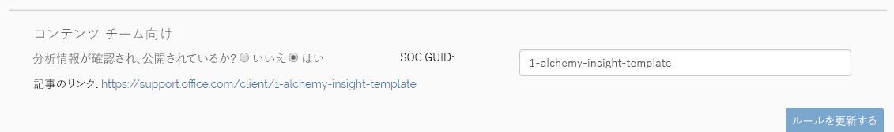

# 必要な Alchemy ヘッダー H1、H2 が機能していません。
Alchemy 作成のベスト プラクティスとガイドライン:

1. **フォルダーで Alchemy 分析情報を入れ子にしないでください**- 入れ子にすると URL の構造が壊れてしまいます。この問題の修正については現在検討中です。
1. **AlchemyInsights** フォルダー内のファイルには、ファイル名に [Alchemy Partner ポータル](https://alchemyportal.azurewebsites.net)のルール ID とルール名が含まれている必要があります。
    1. 例: ***976-How-to-enable-litigation-hold***
1. このファイルの冒頭にあるメタデータをテンプレートとして使用します。それ以外のものは必要ありません。
1. [Alchemy Partner ポータル](https://alchemyportal.azurewebsites.net)で、セクション [**Customer Insight Title:**] まで下方向に移動し、それをインサイトの H1 タイトルの出発点として使用します。 
    > [!NOTE]
    > Alchemy Insight に含むことができる H1 は上部の 1 つに限られます。そうしなければ、運用環境では中断されます。H2 はレンダリングされないため、**太字**またはその他の規則を使用して、個別のセクションを表します。
1. 次に、Alchemy Rule ページの Customer Insights セクションにある下書きの資料を使用して、本文のテキストを入力します。
    1. 箇条書きを使用できます。
    1. 段落番号も使用できます。
    1. **太字**と*斜体*も使用できます。
    1. リンクは常に、内部リンクではなく、**"Web へのリンク"/外部**または **UI 要素へのディープ リンク**のいずれかである必要があります。

また、これは実際には既に少し長すぎます。ベスト プラクティスは約 400 文字です ---------------------------------

コンテンツの準備ができたら、ライブ ブランチに抽出します。次に、[Alchemy Partner ポータル](https://alchemyportal.azurewebsites.net)に移動して、ファイル名を URL フィールドに入力します。確認および発行された分析情報に "はい" と示されていることを確認し、[ルールの更新] をクリックします **(間もなくリリースされる新しいバージョンのポータルではより見栄えが良くなっています)。**

