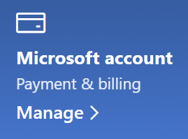

# Microsoft アカウントの情報を変更する

[https://account.microsoft.com](https://account.microsoft.com/) にアクセスし、必要に応じてサインインします。 これにより、アカウントのダッシュボードが表示されます。  

**自分の名前と個人情報を編集する**

1. アカウントのダッシュボードで、アカウントの写真と名前の横にある 3 つのドット (その他の操作) > [プロファイルの編集]** の順にクリックします。
2. [**プロファイルの編集**] ページで、表示されるリンクを使用して、プロファイルの写真、名前、生年月日、場所、表示言語の設定を変更します。 Xbox または Skype アカウント プロファイルへのリンクに注意してください。これらのアカウントの特定の詳細情報を変更できます。

**メール アドレスと電話番号を管理する**

Microsoft アカウントには、「エイリアス」として 1 つ以上のメール アドレスまたは電話番号が関連付けられています。これらを管理するには:

1. アカウントのダッシュボードで、アカウントの写真と名前の横にある 3 つのドット (その他の操作) > **[プロファイルの編集]** の順にクリックします。
2. [**プロファイルの編集**] ページで、[**Microsoft にサインインする方法の管理**] をクリックします。 
3. アカウント エイリアスのリストが表示され、メール アドレスや電話番号の追加や削除など、リストを管理できます。 ここでは、アカウントへのサインインに使用できるエイリアスと、「プライマリ」と見なされるエイリアスを選択できます。これは、Windows 10 デバイスに表示されます。

**お支払い方法と請求の名前と住所を管理する** 

1. アカウントのダッシュボードで、アカウントの写真と名前の横にある 3 つのドット (その他の操作) > **[プロファイルの編集]** の順にクリックします。
2. [**支払いと請求書**] で [**管理**] をクリックします。

    

3. ここでは、支払い方法とそれに関連付けられた請求先の住所を追加、編集、削除できます。 
