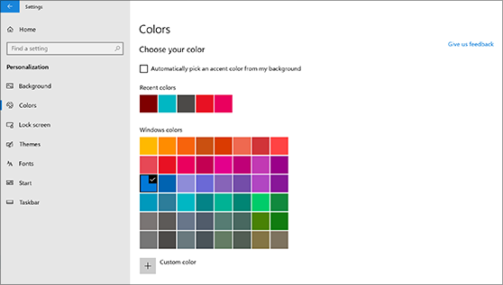
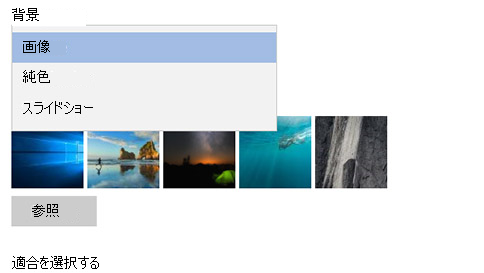

# デスクトップの背景と色を変更する

色の設定を変更するには、[**スタート**] > [**設定**] > [**個人用設定**] > [**色**] の順に移動して独自の色を選択するか、Windows が背景からアクセント色を引き出すようにします。

デスクトップの背景を変更するには、[**スタート**] > [**設定**] > [**個人用設定**] > [**背景**] の順に移動し、画像、単色を選択するか、画像のスライドショーを作成します。 

デスクトップの背景と色をもっと増やしたいですか ? [Microsoft Store](https://www.microsoft.com/store/collections/windowsthemes) にアクセスして、多数の無料テーマの中から選択してください。
