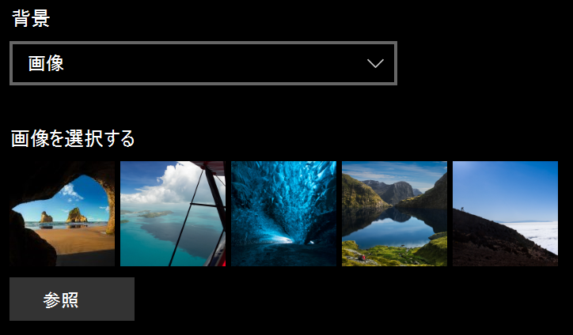
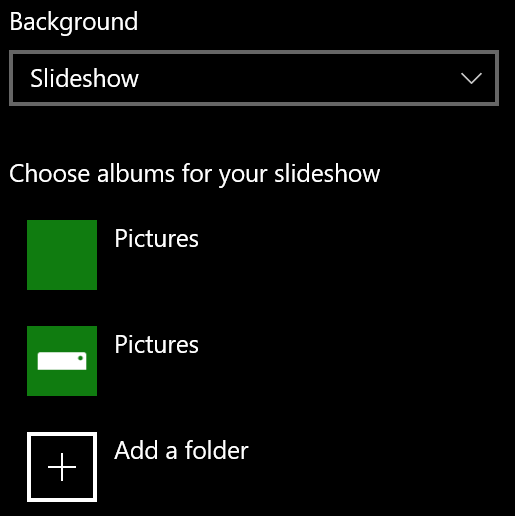

# ロック画面の背景を変更するChange your lock screen background

- [**設定**]  >  [**カスタマイズ**]  > [ **ロック画面**] の順に移動します。Go to **Settings** > **Personalization** > **Lock screen**. または、[ここ](ms-settings:lockscreen?activationSource=GetHelp)をクリックまたはタップします。Or click or tap [here](ms-settings:lockscreen?activationSource=GetHelp).

- カスタムの背景画像を設定するには、[**背景**] のドロップダウン リストから [**画像**] を選択し、画像を[**参照**] するか選択します。To set a custom background picture, select **Picture** from the **Background** drop-down list, and choose or **Browse** to the picture.

  

- カスタム写真のスライドショーを設定するには、[**背景**] のドロップダウン リストから [**スライドショー**] を選択し、アルバムを選択するか、スライドショー用の写真を含むフォルダーを追加します。To set up a slideshow of custom pictures, select **Slideshow** from the **Background** drop-down list, and choose an album or add a folder that contains the pictures for the slideshow.

  
