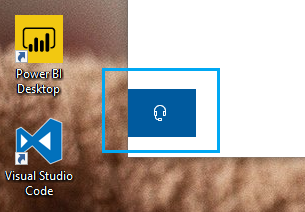

# ヘッドフォン ボタンをクリックして問い合わせる

Microsoft サポートには、このアプリの左下隅にある **[お問い合わせ]** をクリックしてお問い合わせください。 フライアウト ウィンドウでは、製品と問題のカテゴリを選択した後に、適切なサポート チャネルにご案内します。

お問い合わせセッションを開始した後でも、アプリの残りの機能を操作することができます。 お問い合わせパネルは、アプリ内の任意の場所をクリックして一時的に最小化することができます。 同じセッションに戻るには、再度 **[お問い合わせ]** をクリックしてください。
