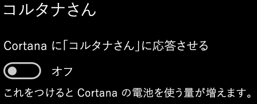

# Cortana と話ができない、または聞こえていないCortana doesn’t talk to me or can’t hear me

タスク バーまたは Cortana パネルのマイク ボタンを選択せずに Cortana と会話ができる "コルタナさん" という機能を使用する場合は、この機能が有効になっていることを確認します。If you are trying to use the "Hey Cortana" feature, which allows you to talk to Cortana without selecting the Cortana button on the taskbar or the microphone button in the Cortana panel, confirm that the feature is enabled:

1. **[スタート]** から、**[[設定]、[Cortana]](ms-settings:cortana?activationSource=GetHelp)** の順に選びます。Go to **Start**, then select **[Settings > Cortana](ms-settings:cortana?activationSource=GetHelp)**.
2. **[コルタナさん]** で、**[「コルタナさん」と言ったらCortana が応答するようにする]** でスイッチを **[オン]** に切り替えます。Under **Hey Cortana**, switch the **Let Cortana respond to "Hey Cortana"** toggle to **On**.

\*\*Cortana が聞き取れないのはプライバシーの設定が原因の場合があります \*\***Are your privacy settings preventing Cortana from hearing you?**

プライバシー設定を使用すると、Cortana が応答できなくなる可能性があります。Your privacy settings can prevent Cortana from responding to your voice.
- オンライン音声認識が有効になっていることを確認します。Check to make sure Online Speech recognition is turned on:
    - **[スタート]** に移動し、**[[設定]、[プライバシー]、[音声]](ms-settings:privacy-speech?activationSource=GetHelp)** の順にクリックします。Go to **Start**, then click **[Settings > Privacy > Speech](ms-settings:privacy-speech?activationSource=GetHelp)**.
    - **[オンライン音声認識]** で、**[オン]** に設定を切り替えます。Under **Online speech recognition**, switch the setting to **On**.
- Cortana にマイクへのアクセス許可が あることを確認します。Check to make sure Cortana has permission to access your microphone. 
    - [スタート]に移動し、**[[設定]、[プライバシー]、[マイク]](ms-settings:privacy-microphone?activationSource=GetHelp)** の順にクリックします。Go to Start, then click **[Settings > Privacy > Microphone](ms-settings:privacy-microphone?activationSource=GetHelp)**.
    - **[マイクにアクセスできるアプリの選択]** で、アプリとサービスの一覧にある **Cortana** 探し、スイッチが **[オン]** に切り替えられていることを確認します。Under **Choose which apps can access your microphone**, look for **Cortana** within the list of apps and services and make sure the switch is toggled to **On**.

また、 Cortana と会話をするために、スピーカーやマイクが正常に動作していることをご確認ください。Moreover, please also make sure that your speakers or microphones are up and working in order to talk to Cortana.
