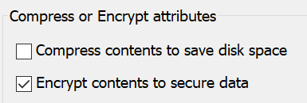

# Windows 10 でファイルまたはフォルダーを暗号化する

ディスク全体を暗号化する場合は BitLocker を使用できますが、個々のファイルまたはフォルダー (およびその内容) のみを暗号化する場合は、以下の操作を行います。

1. [**エクスプローラー**] で、暗号化するファイルまたはフォルダーを選択します (複数選択可)。 この例では、2 つのファイルが選択されています。

    

2. 選択されたファイルまたはフォルダーを右クリックし、[**プロパティ**] をクリックします。

3. [**プロパティ**] ウィンドウで [**詳細**] をクリックします。

4. [**詳細プロパティ**] ウィンドウで、[**内容を暗号化してデータをセキュリティで保護する**] チェックボックスをオンにします。

    

5. [**OK**] をクリックします。
