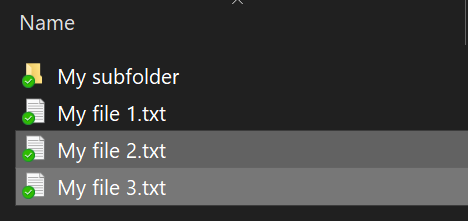

# Windows 10 でファイルまたはフォルダーを暗号化するEncrypt files or folder in Windows 10

ディスク全体を暗号化する場合は BitLocker を使用できますが、個々のファイルまたはフォルダー (およびその内容) のみを暗号化する場合は、以下の操作を行います。You can encrypt an entire disk using BitLocker, but to encrypt only individual files or folders (and their contents):

1. [**エクスプローラー**] で、暗号化するファイルまたはフォルダーを選択します (複数選択可)。In **File Explorer**, select the file(s)/folder(s) you want to encrypt. この例では、2 つのファイルが選択されています。In this example, two files have been selected:

    

2. 選択されたファイルまたはフォルダーを右クリックし、[**プロパティ**] をクリックします。Right-click the selected files and click **Properties**.

3. [**プロパティ**] ウィンドウで [**詳細**] をクリックします。In the **Properties** window, click **Advanced**.

4. [**詳細プロパティ**] ウィンドウで、[**内容を暗号化してデータをセキュリティで保護する**] チェックボックスをオンにします。In the **Advanced Properties** window, select the **Encrypt contents to secure data** checkbox:

    

5. [**OK**] をクリックします。Click **OK**.
