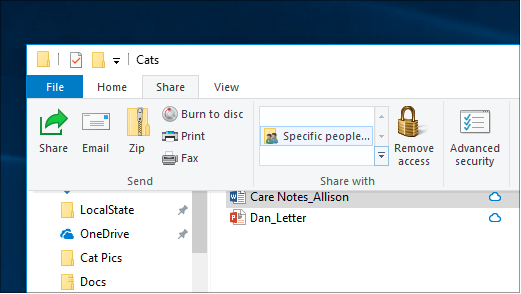

# Windows 10 におけるネットワーク経由のファイル共有

**注**: ファイル共有にホームグループを使用していた場合、ホームグループが Windows 10 (バージョン 1803) から削除されていることにご注意ください。 プリンターやファイルは、Windows 10 の組み込み機能を使用して共有できるようになりました。

**ネットワーク経由でファイルやフォルダーを共有する方法**

- **エクスプローラー**でファイルを選択 > 一番上にある **[共有]** タブをクリック > **[共有]** セクションで **[特定のユーザー]** をクリック。

    
          
- 複数のファイルを一度に選択すると、同じ方法でそれらをすべて共有できます。 フォルダーの場合も同様です。

**ファイルを共有しているネットワーク上のデバイスを表示する方法**

- **エクスプローラー**で **[ネットワーク]** を選択します。 ネットワーク検出が有効になっていない場合、"ネットワーク検出がオフになっており..." というエラー メッセージが表示されます。

- **[ネットワーク検出がオフになっています]** バナーをクリックして、**[ネットワーク検出とファイル共有をオンにする]** をクリックします。

    

[ネットワーク経由のファイル共有についてさらに詳しく確認する](https://support.microsoft.com/help/4092694/windows-10-file-sharing-over-a-network)

[アプリ、OneDrive、メールなどを使用してファイルを共有する](https://support.microsoft.com/help/4027674/windows-10-share-files-in-file-explorer)
