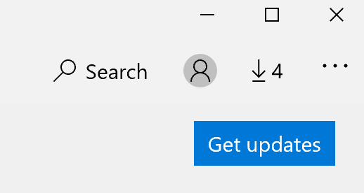

# アプリの表示言語を修正する

Windows 10 の表示言語を変更した後にアプリを開いた場合、以前の言語が使用されていることがあります。 これは、その言語のアプリの新しいバージョンをストアからダウンロードする必要があるためです。 この問題を解決するには、自動更新を待つか、更新されたバージョンのアプリを手動でインストールしてください。

更新プログラムを手動でインストールするには、**[Microsoft Store]** を開き、右上隅にある **[ダウンロードと更新]** をクリックします。 次に、**[最新情報を取得する]** をクリックします。 更新の完了後に言語が変更されない場合は、PC を再起動してください。

入力と表示言語の設定の詳細については、「[Windows 10 で入力および表示の言語設定を管理する](https://support.microsoft.com/help/4027670/windows-10-add-and-switch-input-and-display-language-preferences)」を参照してください。
