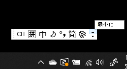
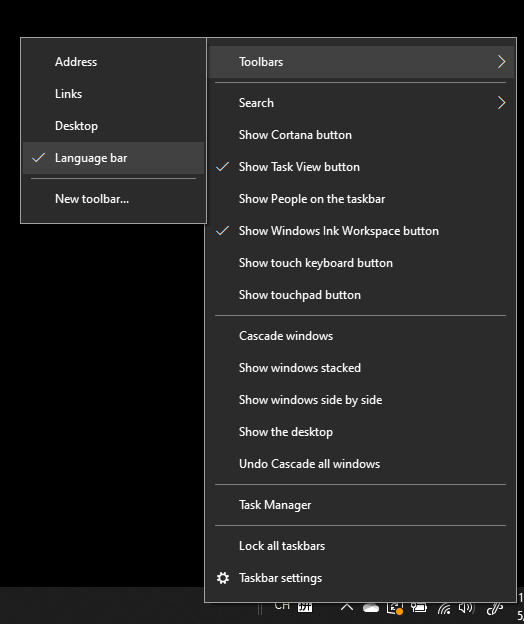
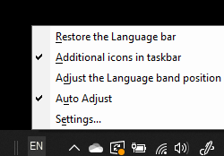

# 言語バーを非表示、表示、またはリセットする

**言語バーを最小化するには:**

言語バーの右上隅にある最小化ボタンをクリックします。 または、言語バーをタスクバーにドラッグするだけで、自動的に最小化できます。

**言語バーをポップアウトするには:**

言語バーをタスクバーにドッキングしない場合は、タスクバーの何もない場所を右クリックし、ツールバー メニューの [**言語バー**] オプションをオフにします。 これにより、前のスクリーンショットのように、言語バーがタスクバーの外側に表示されます。

**言語バーを既定に戻すには:**

ツールバーの言語ボタンを右クリックし、メニューの [**言語バーの復元**] オプションをクリックします。 これにより、既定に戻ります。

