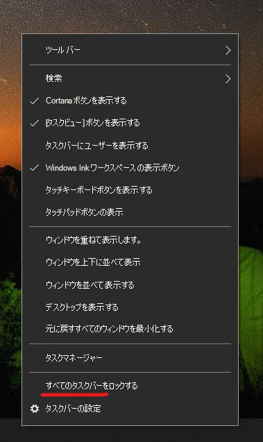

# タスク バーをデスクトップの横または上に移動する

まず、タスク バーが固定されていないことを確認してください。 固定されているかどうかを確認するには、タスク バーの空白領域を右クリックして、[**タスク バーを固定する**] の横にチェックマークがあるかどうかを確認します。 チェックマークがある場合、タスク バーはロックされており、移動できません。 [**タスク バーを固定する**] を 1 回クリックすると、ロックが解除され、チェックマークが削除されます。

タスク バーを表示するモニターが複数ある場合は、「**すべてのタスク バーを固定する**」と表示されます。

タスク バーの固定を外したら、タスク バーの空白領域を長押しして、画面上の目的の場所にドラッグできます。 タスク バーの空白領域を右クリックして、**[[タスク バーの設定]](ms-settings:taskbar?activationSource=GetHelp)、[画面上のタスク バーの位置]** の順に移動することによっても行うことができます。
