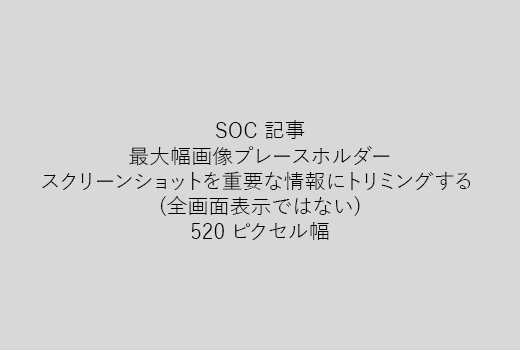

非常に短い説明 (1 文) で、あなたの記事を開始します。読者の立場に自分自身にそれらをここではなぜですか。どのようなことを教えてください。 
  
1. タスクを実行する手順のリストを簡単に直線を取得します。
    
    、概念を説明する必要があります、事前に必要な手順を実行する、または場合は、以下の手順を、必要な概念や手順への[リンク](https://support.office.com/article/f37e7984-cf03-4fde-92d3-82970d7e241b.aspx)と、簡単な概要を追加します。 
    
2. プロシージャできれば 5 つ以下の手順、以上 8 に簡単にしてください。
    
3. 入力するユーザー インターフェイス要素やテキストに必要な**Ui のスタイル**を使用します。 
    
4. 動詞」を選択、またはアクションを入力し、**メニュー**とメニューの書式設定を使用して\>**コマンド**です。
    
5. オプションでは、(UI では、ハードを見つけるには、またはタスクを完了する必要がある) 場合は、コンテキストのスクリーン ショットを追加します。
    
    最大の幅: 520 ピクセルです。標準のテーマを使用して、表示しない個人情報、しは関連のみを表示するのにはトリミング。 
    
    
  
2 列のグリッドを使用して、左とビデオの手順を実行またはスクリーン ショットの右側にあるビデオやスクリーン ショットを追加する場合は、[手順を実行しビデオのグリッドの例](https://support.office.com/article/14ce8e82-efa0-47f5-bb84-94f078db3dae.aspx)を参照してください。 
  
記事には、500 の単語を対象とします。
  
# 資料の例

[写真を変更します。](https://support.office.com/article/555376e0-1fca-49ba-8434-307a0525c767.aspx)
  

