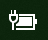
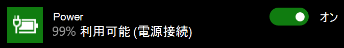

# Windows 10 で電源アイコンまたはバッテリー アイコンが表示されないPower or battery icon missing in Windows 10

Windows 10 デバイスにバッテリーが搭載されている場合 (たとえば、ノート PC またはタブレット、または USB 経由で UPS に接続された PC)、通常、電源/バッテリー アイコンが時計の近くのタスクバーに表示されます。次に例を示します。If your Windows 10 device has a battery (e.g., laptop or tablet, or a PC connected via USB to a UPS), normally a power/battery icon is shown in the taskbar near the clock, for example:

このアイコンが表示されない場合は、非表示になっている可能性があります。If you don't see this icon, it may be hidden:

1. **[[設定]、[個人用設定]、[タスクバー]](ms-settings:taskbar?activationSource=GetHelp)** の順に移動します。Go to **[Settings > Personalization > Taskbar](ms-settings:taskbar?activationSource=GetHelp)**.

2. 通知領域で [**タスク バーに表示するアイコンの選択**] をクリックします。In the Notification area, click **Select which icons appear on the taskbar**.

3. 次に、リストから [**電源**] アイテムを見つけ、その設定を [**オン**] に切り替えます。Then find the **Power** item in the list and toggle its setting to **On**.

    

**トラブルシューティング****Troubleshooting**

上記の手順に従っても、[**電源**] トグルが灰色表示されている、または表示されない場合は、タスクバーの検索ボックスに「**デバイス マネージャー**」と入力し、入力結果のリストから [**デバイス マネージャー**] を選択します。If you followed the above instructions and the **Power** toggle is greyed out or not visible, in the search box on the taskbar, type **device manager**, and then select **Device Manager** in the list of results. [**バッテリー**] で、デバイスのバッテリーを右クリックし、[**無効にする**] をクリックして、[**はい**] をクリックします。Under **Batteries**, right-click the battery for your device, click **Disable**, and click **Yes**. 数秒待ってからバッテリーを右クリックし、[**有効にする**] をクリックします。Wait a few seconds, and then right-click the battery and click **Enable**. デバイスを再起動します。Then restart your device.

上記の手順に従っても、バッテリー アイコンがタスクバーに表示されない場合は、タスクバーの検索ボックスに「**デバイス マネージャー**」と入力し、入力結果のリストから [**デバイス マネージャー**] を選択します。If you followed the above instructions, but the battery icon does not appear on the taskbar, in the search box on the taskbar, type **task manager**, and then click **Task Manager** in the list of results. [**プロセス**] タブの [**名前**] で、[**エクスプローラー**] を右クリックし、[**再起動**] をクリックします。On the **Processes** tab, under **Name**, right-click **Explorer**, and then click **Restart**.
