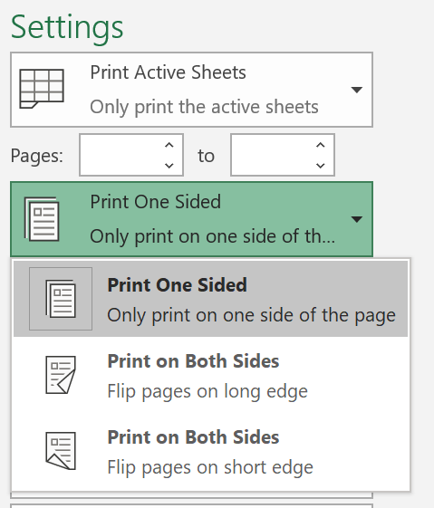
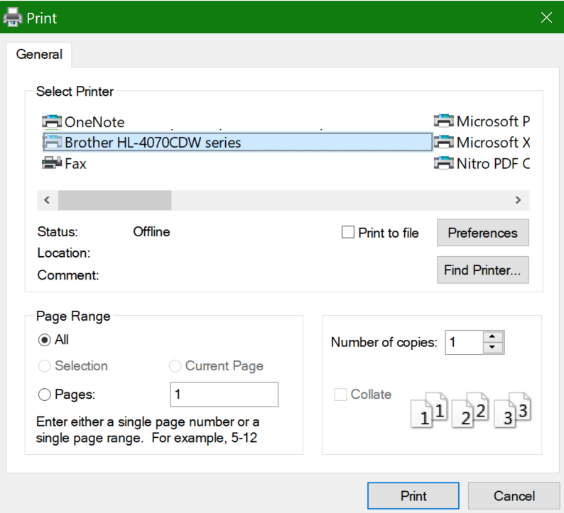

# 用紙の両面印刷 (両面印刷)

**プリンターは両面印刷に対応していますか?**

お使いのプリンターの機能の概要またはマニュアルには、「両面印刷」など、用紙の両面に印刷できるかどうかが記載されています。 Microsoft Office を使用している場合は、Word や Excel などの Office アプリを開き、**[ファイル]、[印刷]** の順に移動して、適切なプリンターが選択されていることを確認し、[設定] セクションで機能を探します。 以下に例を示します。 

**Microsoft Office での両面印刷**

お使いのプリンターが両面印刷が可能な場合、Office アプリで **[ファイル]、[印刷]** の順に移動すると、上の例に示すように、[両面印刷] のオプションが表示されます。  必要な両面印刷の種類 ([長辺を綴じる]、または [短辺を綴じる]) を選択し、[**印刷**] をクリックして印刷を開始します。

**あらゆるアプリケーションからの両面印刷**

多くのアプリで印刷すると、次のような一般的な印刷ダイアログが表示されます。 

適切なプリンターが選択されていることを確認し、[**設定**] をクリックしてプリンター設定ウィンドウを開きます。 プリンターが両面印刷に対応している場合、現在の印刷ジョブでこれを有効にする機能がそのウィンドウに表示されます。
