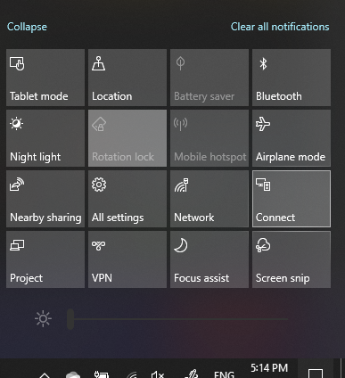

# PC に投影する

ターゲットデバイス (投影先) で、「プロジェクション設定」 を検索して、**[この PC へのプロジェクション]** の設定ページを開きます。 次に、以下のことを確認します:
- "一部のWindows と Android デバイスは、[OK]と言った場合にこのPCに移すことができます" ドロップダウン メニュー: **[常にオフ]**
- "この PC への出力を求める" ドロップダウン メニュー: **[毎回接続を要求する]**
- "ペアリングに PIN を要求する" ドロップダウンメニュー: **[なし]**

接続先のデバイスで、**[スタート]** に移動して、**「接続」** と検索し、接続アプリを起動します。

次に、投影 を使用しているソース デバイス上で、次の操作を行います。

1. **Windows キーを押しながら** を押してアクションセンターを開きます。
2. **[接続]** をクリックします。
3. 画面を投影をするデバイスをクリックします。

上記の手順を実行すると、投影先のデバイスはセカンダリ モニターのようにソース デバイスの画面を表示するはずです。
