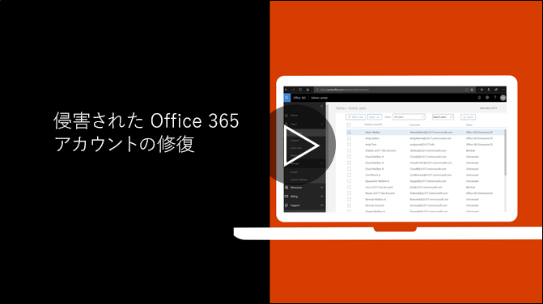

# アカウントが危険にさらされた場合に実行する推奨される手順を実行します。Recommended steps to take if an account is compromised

  
1. [ユーザーのパスワードをリセットする](https://support.office.com/article/7a5d073b-7fae-4aa5-8f96-9ecd041aba9c)直前です。エンド ・ ユーザーに新しいパスワードを電子メールは通信できません。[Reset the user's password](https://support.office.com/article/7a5d073b-7fae-4aa5-8f96-9ecd041aba9c) immediately. Do not communicate the new password through email to the end user. 
    
2. 不審な[アドレスを転送する](https://support.office.com/article/ab5eb117-0f22-4fa7-a662-3a6bdb0add74)メールボックス レベルで設定を削除します。Remove any suspicious [forwarding addresses](https://support.office.com/article/ab5eb117-0f22-4fa7-a662-3a6bdb0add74) set at the mailbox level. 
    
3. 不審な[受信トレイ ルール](https://support.office.com/article/1433E3A0-7FB0-4999-B536-50E05CB67FED)をメールボックス内の設定を削除します。Remove any suspicious [inbox rules](https://support.office.com/article/1433E3A0-7FB0-4999-B536-50E05CB67FED) set within the mailbox. 
    
4. 場合は、ユーザー[アカウントのブロックを解除する制限付きのユーザーに](https://protection.office.com/?hash=/restrictedusers)電子メールの送信がブロックされます。終わったら、ユーザーが 1 時間内でメッセージの送信を再開することがあります。If the user is blocked from sending email, [go to the Restricted Users to unblock the account](https://protection.office.com/?hash=/restrictedusers). Once done, the user should be able to resume sending messages within 1 hour.
    
5. アカウントが不要になった侵害するいると確信できるまで、すべての[管理者の役割グループ](https://support.office.com/article/eac4d046-1afd-4f1a-85fc-8219c79e1504)からユーザー アカウントを削除します。Remove the user account from any [administrative role groups](https://support.office.com/article/eac4d046-1afd-4f1a-85fc-8219c79e1504) until you are confident that the account is no longer compromised. 
    
将来的にデータの漏洩やセキュリティを侵害されたアカウントの可能性を最小限に抑えるには、私たちの[Office 365 のセキュリティのベスト プラクティスの記事](https://support.office.com/article/9295e396-e53d-49b9-ae9b-0b5828cdedc3)を読むをお勧めします。To minimize the potential of a data breach or a compromised account in the future, we recommend reading our [Office 365 Security best practices article](https://support.office.com/article/9295e396-e53d-49b9-ae9b-0b5828cdedc3).
  

