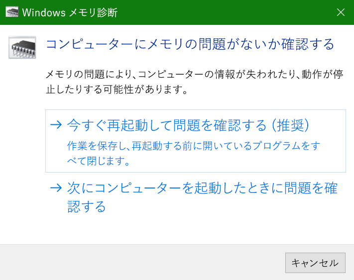
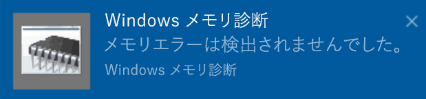

# Windows 10 の Windows メモリ診断を実行するRun Windows Memory Diagnostics in Windows 10

PC の Windows およびアプリがクラッシュしたり、フリーズしたり動作が不安定になったりする場合、PC のメモリ (RAM) に問題がある可能性があります。If Windows and apps on your PC are crashing, freezing, or acting in an unstable manner, you may have a problem with the PC’s memory (RAM). Windows メモリ診断を実行して、PC の RAM に問題があるかどうかを確認できます。You can run the Windows Memory Diagnostic to check for problems with the PC’s RAM.

タスクバーの検索ボックスに **「メモリ診断」** と入力し、**[Windows メモリ診断]** を選択します。In the search box on your taskbar, type **memory diagnostic**, and then select **Windows Memory Diagnostic**. 

診断を実行するには、PC の再起動が必要です。To run the diagnostic, the PC needs to restart. すぐに再起動するか、(作業内容を保存して、開いているドキュメントと電子メールを先に終了します)。または、次回 PC が再起動したときに自動的に実行されるように診断をスケジュールすることができます。You have the option to restart immediately (please save your work and close open documents and e-mails first), or schedule the diagnostic to run automatically the next time the PC restarts:

PC が再起動すると、\*\* Windows メモリ診断ツール\*\*が自動的に実行されます。When the PC restarts, the **Windows Memory Diagnostics Tool** will run automatically. 診断実行時に状態と進捗状況が表示されます。また、使用しているキーボードの **ESC** キーを押して診断をキャンセルすることもできます。Status and progress will be displayed as the diagnostics run, and you have the option of cancelling the diagnostics by hitting the **ESC** key on your keyboard.

診断が完了すると、Windows は正常に起動します。When the diagnostics are complete, Windows will start normally.
再起動した直後にデスクトップが表示されると、(**アクションセンター**のタスク センターのアイコンの横) メモリ エラーが検出されたかどうかを示す通知が表示されます。Immediately after restart, when the Desktop appears, a notification will appear (next to the **Action Center** icon on the taskbar), to indicate whether any memory errors were found. 例:For example:

アクション センターのアイコン:Here's the Action Center icon:  

通知のサンプル:And a sample notification: 

通知を見逃した場合は、タスクバーの **[アクション センター]** アイコンを選択 し、**アクション センター**を表示して スクロール可能な通知の一覧を表示することができます。If you missed the notification, you can select the **Action Center** icon  on the taskbar to display the **Action Center** and see a scrollable list of notifications.

詳細情報を確認するには、タスクバーの検索ボックスに **「イベント」** と入力して、**[イベントビューアー]** を選択します。To review detailed information, type **event** into the search box on your taskbar, and then select **Event Viewer**. **イベントビューアー**の左側のウィンドウで、**[Windows ログ]、[ システム]** に移動 ます。In the **Event Viewer**’s left-hand pane, navigate to **Windows Logs > System**. 右側のウィンドウで、Source 値 **"MemoryDiagnostics-結果"** のイベントが表示されるまで **[ソース]** 列を見ながら一覧を下にスキャンします。In the right-hand pane, scan down the list while looking at the **Source** column, until you see events with Source value **MemoryDiagnostics-Results**. それぞれのイベントを強調表示し、一覧の下にある **[全般]** タブ の下のボックスに結果情報を表示します。Highlight each such event and see the result information in the box under the **General** tab below the list.
