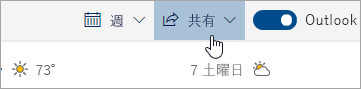

# Outlook on the web で共有する

1. ページの下部にある [予定表] を選択し、[予定表] に移動します。

2. [予定表] で、ページの上部にあるツールバーの [ **共有**] を選択し、共有する予定表を選択します。 

    

    **注**: 他のユーザーが所有している予定表を共有することはできません。

3. 予定表を共有するユーザーの名前かメール アドレスを入力します。

4. ユーザーが予定表を使用する方法を選択します。 
    - [**予定ありを表示** ] を選択した場合、予定があることはわかりますが、イベントの場所など、詳細は表示されません。 
    - [**件名と場所を表示** ] を選択した場合、予定があることに加え、イベントの件名と場所が表示されます。 
    - [**すべての詳細を表示** ] を選択した場合、イベントの全詳細が表示されます。 
    - [**編集可能** ] を選択した場合、予定表を編集できます。 
    - [**代理** ] を選択した場合、そのユーザーが予定表を編集し、他のユーザーと共有することができます。

5. [ **共有**] を選択します。 予定表をすぐに共有しない場合、[ **削除**] を選択します。 

**注**:  

- Gmail を使用しているユーザーなど、Outlook on the web を使用していない他のユーザーと予定表を共有すると、Microsoft 365 または Outlook.com アカウントを使用する招待を承諾することのみができます。 

- ICS 予定表は読み取り専用です。編集アクセスを他のユーザーに与えた場合でも、予定表を編集することはできません。 

- ICS 予定表の同期頻度は、共有相手のメール プロバイダーに依存します。 

- 非公開とマークされた予定表アイテムは保護されます。 予定表を共有しているほとんどのユーザーには、非公開とマークされたアイテムのみが表示され、タイトル、場所、その他の詳細は表示されません。 非公開とマークされた定期的なアイテムは、定期的なパターンも表示されます。
