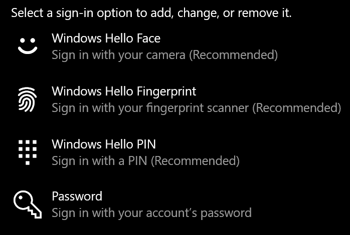
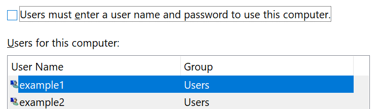

# パスワードを使用しないで Windows 10 にサインインするSign-in to Windows 10 without using a password

Windows の起動時にパスワードを入力する必要がないようにするためには、PIN、顔認識、指紋などの Windows Hello の安全なサインイン オプションを使用することをお勧めします。To avoid having to type a password at Windows startup, we recommend you use one of the Windows Hello secure sign-in options, like a PIN, face recognition, or fingerprint, if available. 安全なサインインを無効にするには、以下の「Windows 10 に自動的にサインインする」の手順をご覧ください。If you really want to disable secure sign-in, see the "Automatically sign in to Windows 10" instructions below.

**アカウント パスワードに代わる Windows Hello の安全な代替機能****Secure Windows Hello alternatives to the account password**

**[設定] > [アカウント] > [サインイン オプション]** に移動します (または [こちら](ms-settings:signinoptions?activationSource=GetHelp)をクリックします)。Go to **Settings  > Accounts > Sign-in options** (or click [here](ms-settings:signinoptions?activationSource=GetHelp)). 利用可能なサインイン オプションが表示されます。Available sign-in options will be listed. 例:For example:

いずれかをクリックまたはタップして、オプションを構成します。Click or tap one of the options to configure it. 次に Windows を起動またはロック解除するときより、パスワードに代わって新しいオプションを利用できるようになります。Next time you start or unlock Windows, you will be able to use the new option instead of a password. 

**Windows 10 に自動的にサインインする****Automatically sign-in to Windows 10**

**注**: 自動サインインは便利ですが、複数の人物が PC にアクセスできる場合は、セキュリティ上のリスクが生じます。**Note**: Automatic sign-in is convenient, but introduces a security risk, especially if your PC is accessible by multiple people. 

1. タスクバーの **[スタート]** ボタンをクリックまたはタップします。Click or tap the **Start** button in the Taskbar.

2. **netplwiz** と入力して Enter キーを押し、[ユーザー アカウント] ウィンドウを開きます。Type **netplwiz** and hit the Enter key to open the User Accounts window.

3. **[ユーザー アカウント]** で、Windows の起動時に自動的にサインインするアカウントをクリックします。In **User Accounts**, click the account you want to automatically sign in to when Windows starts.

4. 「ユーザーがこのコンピューターを使うには、ユーザー名とパスワードの入力が必要」のチェックボックスをオフにします。Uncheck the "Users must enter a user name and password to use this computer" checkbox.

    

5. **[OK]** をクリックします。Click **OK**. 選択したアカウントのパスワードを入力するように求められます。You will be asked to enter and confirm the password for the account you selected. **[OK]** をクリックして終了します。Click **OK** to finish. 次回 Windows 10 を起動すると、選択したアカウントに自動的にサインインします。Next time Windows 10 starts, it will automatically sign in to the account you selected.
