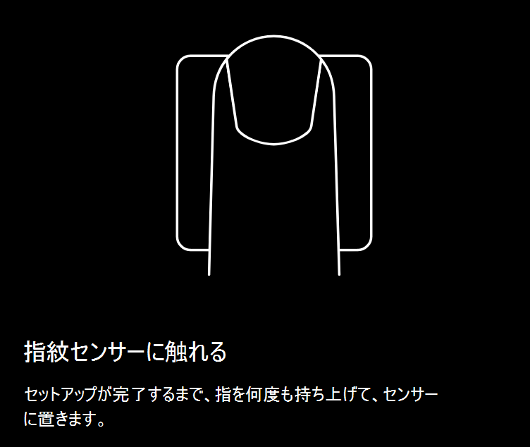
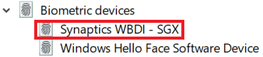

# Windows 10 で指紋ロック解除オプションを使うUse fingerprint unlock option in Windows 10

**Windows Hello 指紋認証を有効にする****Enable Windows Hello Fingerprint**

指紋を使用して Windows 10 のロックを解除するには、Windows Hello 指紋認証を設定する必要があります。これには少なくとも 1 本の指を追加 (Windows に登録) します。To unlock Windows 10 using your fingerprint, you need to set up Windows Hello Fingerprint by adding (letting Windows learn to recognize) at least one finger. 

1. **[設定] > [アカウント] > [サインイン オプション]** に移動します (または[こちら](ms-settings:signinoptions?activationSource=GetHelp)をクリックします)。Go to **Settings  > Accounts > Sign-in options** (or click [here](ms-settings:signinoptions?activationSource=GetHelp)). 利用可能なサインイン オプションが表示されます。Available sign-in options will be listed. 例:For example:

    

2. **[Windows Hello 指紋認証]** をクリックまたはタップし、次に **[設定]** をクリックします。Click or tap **Windows Hello Fingerprint**, then click **Set up**. Windows Hello 設定ウィンドウで、**[開始する]** をクリックします。In the Windows Hello setup window, click **Get started**. 指紋センサーがアクティブになり、このセンサーに指を合わせるように求められます。The fingerprint sensor will activate, and you'll be asked to place your finger on the sensor:

   

3. 指示に従って、指を繰り返しスキャンします。Follow the instructions, which will ask you to repeatedly scan your finger. これが完了したら、サインインに使用する可能性がある他の指を追加するオプションが表示されます。When this is finished, you'll have the option of adding other fingers you may want to use for sign-in. 次回 Windows 10 にサインインするときには、指紋を利用してサインインできます。Next time you sign in to Windows 10, you will have the option of using your fingerprint to do so.

**サインイン オプションとして、Windows Hello 指紋認証が利用できない****Windows Hello Fingerprint not available as a sign-in option**

Windows Hello 指紋認証が**サインイン オプション**に表示されていない場合は、Windows が PC に接続されている指紋リーダーやスキャナーを認識していないか、システム ポリシーがその利用を認めていないということです (たとえば、PC が職場で管理されている場合など)。If Windows Hello Fingerprint is not shown as an option in **Sign-in options**, it means Windows is not aware of any fingerprint reader/scanner attached to your PC, or that a system policy prevents its use (if for example your PC is managed by your workplace). トラブルシューティング:To troubleshoot: 

1. タスク バーの **[スタート]** ボタンを選択し、**[デバイス マネージャー]** を探します。Select the **Start** button in the Taskbar and search for **Device Manager**.

2. クリックまたはタップし、**[デバイス マネージャー]** を開きます。Click or tap to open **Device Manager**.

3. [デバイス マネージャー] で、シェブロンをクリックして [生体認証デバイス] を展開します。In Device Manager, expand Biometric devices by clicking its chevron.

   

4. 指紋スキャナーが生体認証デバイス (Synaptics WBDI スキャナーなど) に表示されているはずです。Your fingerprint scanner should be listed as a biometric device, such as the Synaptics WBDI scanner:

   

5. 指紋スキャナーが表示されず、スキャナーが PC に統合されている場合は、PC の製造元の Web サイトを参照してください。If your fingerprint scanner is not shown, and the scanner is integrated into your PC, go to the PC manufacturer's website. PC モデルの [テクニカル サポート] セクションで、インストール可能なスキャナー用の Windows 10 ドライバーを検索します。In the technical support section for your PC model, search for a Windows 10 driver for a scanner that you can install.

6. スキャナーが PC と別の場合 (USB で接続されている場合) は、スキャナーの製造元の Web サイトに移動して、使用しているスキャナー モデルの Windows 10 デバイス ドライバー ソフトウェアを見つけてインストールします。If the scanner is separate from the PC (attached via USB), go to the scanner manufacturer's website to find and install Windows 10 device driver software for the scanner model you have.
