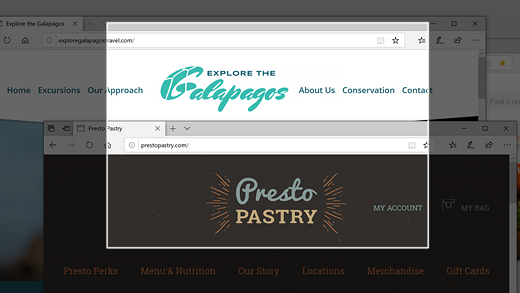
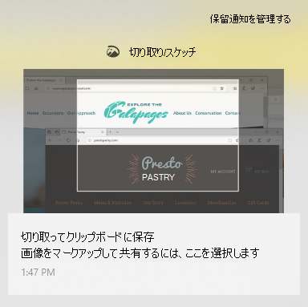

# 切り取り & スケッチを使用した、画像のキャプチャ、マークアップ、共有Use Snip & Sketch to capture, mark up, and share images

画面スケッチは、**切り取り & スケッチ**に名称が変更されました。Screen sketch is now called **Snip & Sketch**. **すばやく切り取る方法**:**To quickly take a snip**:

1. **Windows ロゴ キー、Shift キー、S キー**を同時に押します。画面表示が暗くなり、カーソルが十字形で表示されます。Press the **Windows logo key + Shift + S**. You'll see your screen darken and your cursor displayed as a cross. 

2. コピーしたい領域の端にあたる点を選び、カーソルを左クリックします。Choose a point at the edge of the area you want to copy and left-click the cursor. 

3. カーソルを移動すると、キャプチャする領域が強調表示されます。Move your cursor to highlight the area you want to capture. キャプチャした領域が画面に表示されます。The area you capture will appear on your screen.

   

切り取った領域はクリップボードに保存され、メールやドキュメントに貼り付けることができます。The image you snipped is saved to your clipboard, ready for pasting into an email or document. 

**画像を編集または表示したい場合**:**If you want to edit or view the image**: 

- タスクバーの右端にある通知アイコンをクリックします。その後、キャプチャした画像をクリックします。Click the notifications icon at the far right side of the taskbar; then click the picture you have just captured. 切り取り & スケッチ アプリで切り取り領域が開きます。Your snip opens in the Snip & Sketch app.

   
