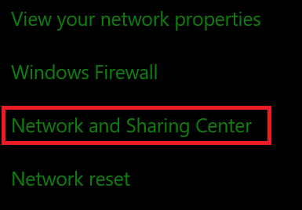
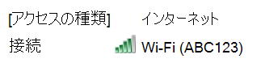
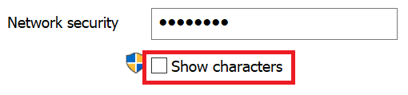

# Windows 10 で Wi-Fi ネットワーク パスワードを表示するView Wi-Fi network password in Windows 10

1. Windows 10 PC が Wi-Fi ネットワークに接続されていることを確認します。Make sure your Windows 10 PC is connected to the Wi-Fi network.

2. **[設定] > [ネットワークとインターネット] > [状態]** に移動するか、[こちら](ms-settings:network?activationSource=GetHelp)をクリックまたはタップして移動します。Go to **Settings  > Network & Internet  > Status**, or click or tap [here](ms-settings:network?activationSource=GetHelp) to let us take you there now.)

3. **[ネットワークと共有センター]** をクリックします。Click **Network and Sharing Center**.

    

4. **[ネットワークと共有センター]** の **[接続]** の横に、ご使用中のワイヤレス ネットワークの名前が表示されます。In **Network and Sharing Center**, next to **Connections**, you will see the name of your wireless network. たとえば、ネットワークが "ABC123" という名前なら、次のように表示されます。For example, if your network is named "ABC123," you might see:

    

    ワイヤレス ネットワーク名をクリックして、[Wi-Fi の状態] ウィンドウを開きます。Click the wireless network name to open the Wi-Fi Status window. 

5. [Wi-Fi の状態] ウィンドウで、**[ワイヤレスのプロパティ]** をクリックします。**[セキュリティ]** タブをクリックして、**[パスワードの文字を表示する]** をオンにします。In the Wi-Fi Status window, click **Wireless Properties**, click the **Security** tab, and check **Show characters**.

    

