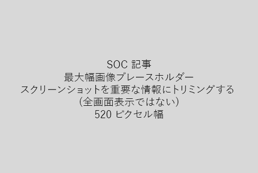

非常に短い説明 (1 文) で、あなたの記事を開始します。読者の立場に自分自身にそれらをここではなぜですか。どのようなことを教えてください。Start your article with a very short introduction (1 sentence). Put yourself in the reader's place - why are they here? What should they do? 
  
1. タスクを実行する手順のリストを簡単に直線を取得します。Get straight to a quick list of steps to accomplish the task.
    
    、概念を説明する必要があります、事前に必要な手順を実行する、または場合は、以下の手順を、必要な概念や手順への[リンク](https://support.office.com/article/f37e7984-cf03-4fde-92d3-82970d7e241b.aspx)と、簡単な概要を追加します。If you need to explain a concept, or they have to do pre-requisite steps, add a quick summary below the step where they need it, and [link](https://support.office.com/article/f37e7984-cf03-4fde-92d3-82970d7e241b.aspx) to the concept or steps. 
    
2. プロシージャできれば 5 つ以下の手順、以上 8 に簡単にしてください。Keep procedures short - preferably 5 or fewer steps, no more than 8.
    
3. 入力するユーザー インターフェイス要素やテキストに必要な**Ui のスタイル**を使用します。Use **Ui style** for user interface elements or for text people need to enter. 
    
4. 動詞」を選択、またはアクションを入力し、**メニュー**とメニューの書式設定を使用して\>**コマンド**です。Use the verbs choose, select, or enter as actions, and format menus as **Menu** \> **Command**.
    
5. オプションでは、(UI では、ハードを見つけるには、またはタスクを完了する必要がある) 場合は、コンテキストのスクリーン ショットを追加します。Optionally, add a screenshot for context (if UI is hard to locate, or it's needed to complete the task).
    
    最大の幅: 520 ピクセルです。標準のテーマを使用して、表示しない個人情報、しは関連のみを表示するのにはトリミング。Maximum width: 520 pixels. Use a standard theme, do not show any personal information, and crop to show only what's relevant. 
    
    
  
2 列のグリッドを使用して、左とビデオの手順を実行またはスクリーン ショットの右側にあるビデオやスクリーン ショットを追加する場合は、[手順を実行しビデオのグリッドの例](https://support.office.com/article/14ce8e82-efa0-47f5-bb84-94f078db3dae.aspx)を参照してください。If you want to add a video or screenshot, use a two-column grid and have the steps in the left and the video or screenshot in the right - see [Steps and video grid example](https://support.office.com/article/14ce8e82-efa0-47f5-bb84-94f078db3dae.aspx). 
  
記事には、500 の単語を対象とします。Target no more than 500 words for an article.
  
# 資料の例Example article

[写真を変更します。Change my photo](https://support.office.com/article/555376e0-1fca-49ba-8434-307a0525c767.aspx)
  

